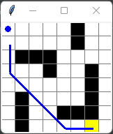
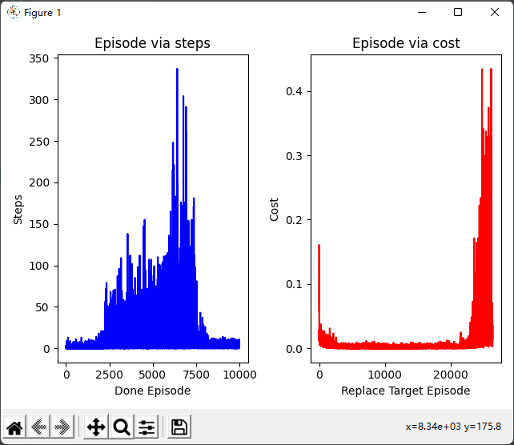

# 参数
## 试验记录
### 对于环境 env_small_complex2.py 
当仅设置1个隐藏层，且其层数为60时，  
地图环境为  
#### 参数设定1
* 学习率`learning_rate = 0.01  `
* 初始样本个数为1000，且每5步进行迭代  
`if (total_step > 1000) and (total_step % 5 == 0)...`

#### 试验结果
训练速度快，但是收敛速度响度较慢  
7000次左右趋于正常路径，且达到终点的次数为1213  

#### 参数设定2
* 学习率`learning_rate = 0.01  `
* 初始样本个数为300，且每3步进行迭代  
`if (total_step > 300) and (total_step % 3 == 0)...`
#### 试验结果
7000次左右趋于正常路径，且达到终点的次数为1213  

